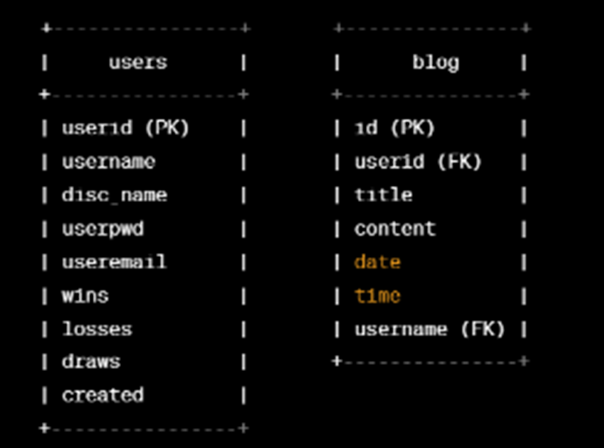
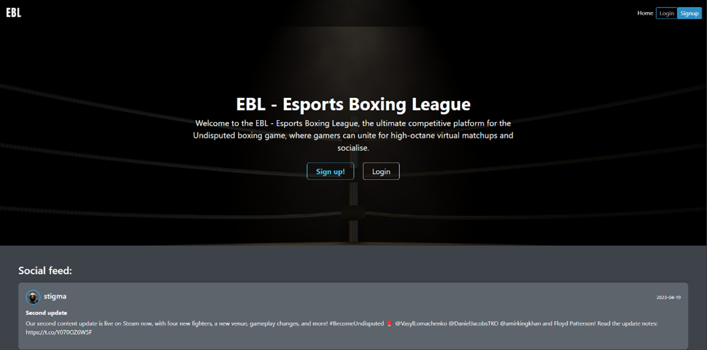
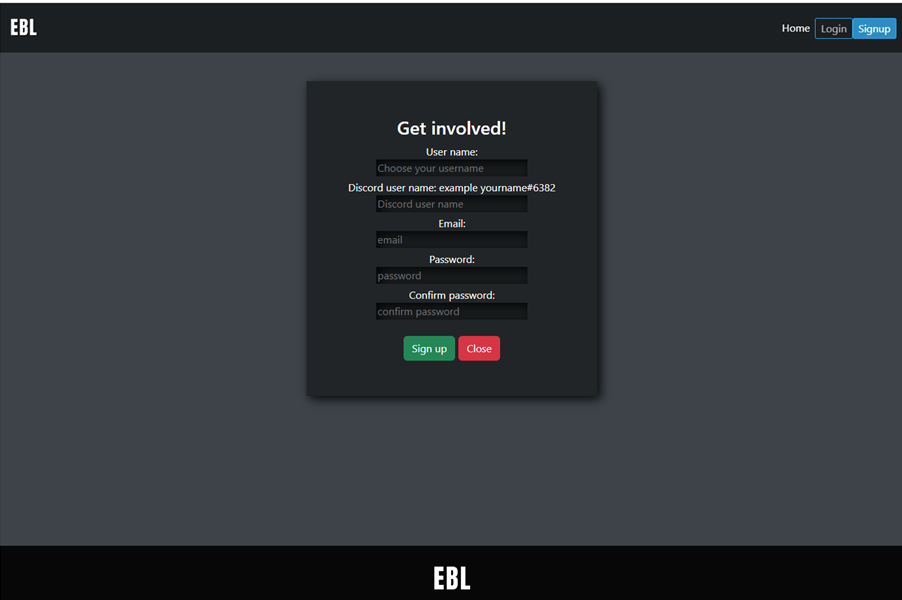
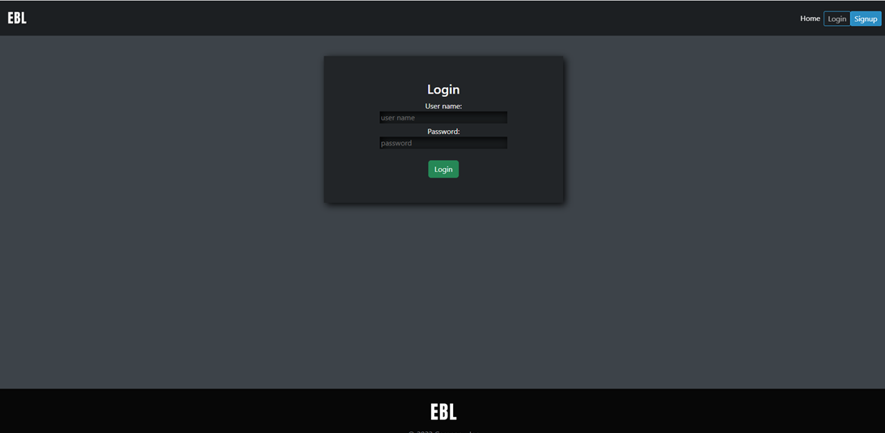
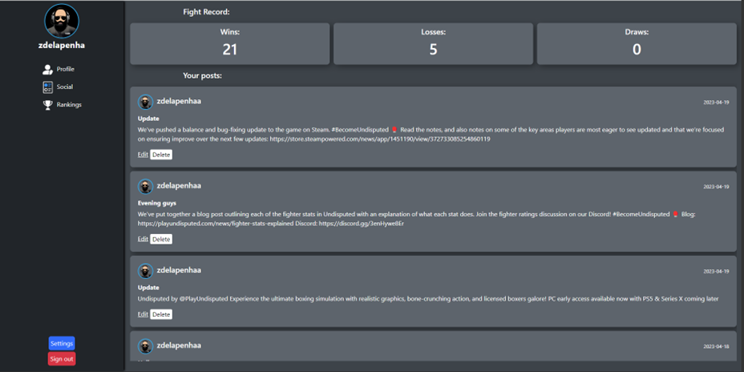
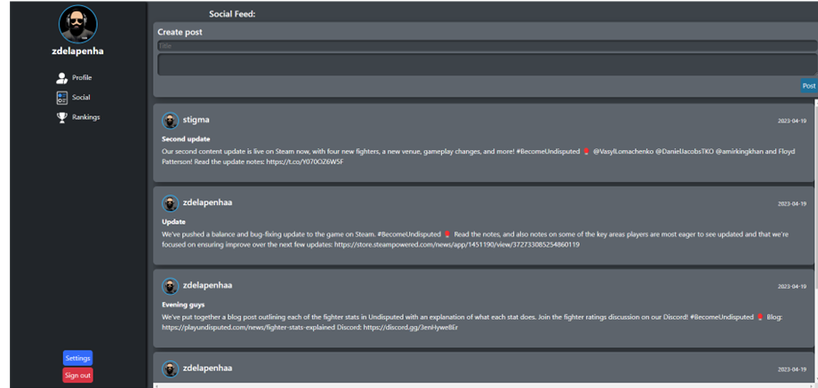
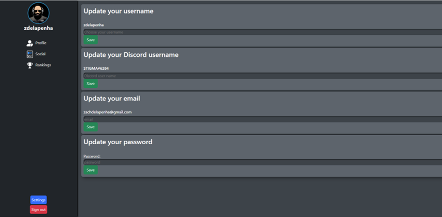

# Esport Boxing League CMS – By Zach Delapenha

## CONTENTS

1. INTRODUCTION
2. MODEL - Manages Data and Business Logic
   1. Database Scheme
   2. Database Connection
3. VIEW / CONTROLLER - Handles Layout and Display, and routes commands to the model
   1. Pages
      1. Home page
      2. Signup page
      3. Login page
      4. Profile page
      5. Social page
      6. Settings page
4. HOSTED WEBSITE
5. FUTURE IMPROVEMENTS
6. HOSTING

## INTRODUCTION

link to the site here: http://esportsboxingleague.lovestoblog.com/index.php

In this assignment, I was tasked to create an CMS to consume a minimal front end application with full CRUD functionality accross the site.

In this project i followed the MVC design pattern. The model handles the data and business logic, the view handles the layout and display and the controller handles the routing of commands to the model.

To enable crud functionality i used a mySQL database to store the data and used php to connect to the database and perform the CRUD operations.

I then created a front end application to consume the CMS. The front end application is a simple website that allows users to sign up and login to the site. It also allows users to view blog posts from other users, post their own blog posts, and edit and delete their own blog posts.

Each component that needs to perform a CRUD operation does so in the following way:

1. The user performs an action on the front end application.
2. The front end application sends a request to the backend where the request is handled by a controller.
3. The controller then performs the CRUD operation on the database.
4. The controller then sends a response back to the front end application.

## MODEL - Manages Data and Business Logic

### 1. Database Scheme

This database is very simple, it holds a users table in which the users information can be stored and a blog table where user's blog posts can be stored linked to them by their ID.

#### Table Definitions:

users:

- userid (Primary Key, int)
- username (varchar)
- disc_name (varchar)
- userpwd (varchar)
- useremail (varchar)
- wins (int)
- losses (int)
- draws (int)
- created (datetime)

blog:

- id (Primary Key, int)
- userid (Foreign Key references users.userid, int)
- title (varchar)
- content (text)
- date (date)
- time (time)
- username (Foreign Key references users.username, varchar)

#### Column Defintions:

users:

- userid: Unique identifier for each user in the system.
- username: Unique username for each user.
- disc_name: Discord name for the user.
- userpwd: Encrypted password for user login.
- useremail: Email address for the user.
- wins: Number of wins the user has.
- losses: Number of losses the user has.
- draws: Number of draws the user has.
- created: Date and time when the user account was created.

blog:

- id: Unique identifier for each blog post.
- userid: Foreign key referencing the user who created the blog post.
- title: Title of the blog post.
- content: Content of the blog post.
- date: Date when the blog post was created.
- time: Time when the blog post was created..
- username: Foreign key referencing the username of the user who created the blog post.

### 2. Database Connection

My database-classes.php file holds the Database class. This establishes a connection to the database and allows me to easily reuse the connection by calling the connection() function in other files.

        // Database class to establish connection to the database and to be extended by other classes
    class Database
    {
        protected function connection()
        {
            // try catch to establish connection to database
            try {
                $server = "sql303.epizy.com";
                $username = "epiz_34038138";
                $password = "yelKNKdc3OgkQTX";
                $dbname = "epiz_34038138_cmsproject";

                $dsn = "mysql:host=$server;dbname=$dbname";
                $conn = new PDO($dsn, $username, $password);

                // Set PDO error mode to exception
                $conn->setAttribute(PDO::ATTR_ERRMODE, PDO::ERRMODE_EXCEPTION);

                return $conn;
            } catch (PDOException $e) {
                echo "Connection failed: " . $e->getMessage();
                die();
            }
        }
    }

## VIEW / CONTROLLER - Handles Layout and Display, and routes commands to the model

### 1. Pages

#### Home page

The main aim of this page is to allow users to sign up and login to the site. It also allows users to view blog posts from other users.

#### Signup page

The signup page allows users to create an account on the site. It has a form that requires the user to enter a username, discord name, password, and email address.

The form also has a submit button that sends the data to the signup.php file.

The signup.php file receives the POST data and stores it in variables. It then creates a new SignupCont object and pasess the form data to the constructor in the signup controller class.

    <?php

    if (isset($_POST["submit"])) {

        // Assign data from signup form to variables to be used in the signup controller
        $username = $_POST["username"];
        $discord = $_POST["discord"];
        $email = $_POST["email"];
        $password = $_POST["password"];
        $confirmPassword = $_POST["confirmPassword"];

        // Includes database, signup controller and controller classes
        require_once "../../model/database-classes.php";
        require_once "../classes/signupClass.php";
        require_once "../signupCont.php";

        // Create new signup object and pass the form data to the constructor in the signup controller =
        $signup = new SignupCont($username, $discord, $email, $password, $confirmPassword);

        // Call userSignup method
        $signup->userSignup();

        header("location: ../index.php?error=none");
    }

The signupCont class then validates each field to make sure it is not empty and matches the form validation requirements. If all the fields are valid then the insertUser function is called and the user is added to the database. If any of the fields are invalid then the form will not submit and the user will be prompted to fix the errors.

The errors message are inserted into an error element div in the form, I achieved this by checking the url for the error message and then displaying the error message in the form. like this:

    $fullUrl = "http://$_SERVER[HTTP_HOST]$_SERVER[REQUEST_URI]";

    if (strpos($fullUrl, "error=emptyinput") == true) {
        echo "<h6 style='color: red;'>Fill in all fields!</h6>";
        } elseif (strpos($fullUrl, "error=wronglogin") == true) {
            echo "<h6 style='color: red;'>Incorrect login details!</h6>";
        } elseif (strpos($fullUrl, "error=stmtfailed") == true) {
            echo "<h6 style='color: red;'>An error occured </h6>";
        } elseif (strpos($fullUrl, "error=wronglogindetails") == true) {
            echo "<h6 style='color: red;'>Check username and /or password </h6>";
        }

This was a very simple way to display the error messages and I will be using this method in the future.

#### Login page

The login page allows users to login to the site. It has a form that requires the user to enter a username and password.

The form also has a submit button that sends the data to the login.php file.

The login.php file receives the POST data and stores it in variables. It then creates a new LoginCont object and pasess the form data to the constructor in the login controller class.

    <?php

    if (isset($_POST["submit"])) {

        // Assign data from login form to variables
        $username = $_POST["loginUsername"];
        $password = $_POST["loginPassword"];

        // Includes signup class and controller
        require_once "../../model/database-classes.php";
        require_once "../classes/loginClass.php";
        require_once "../loginCont.php";

        // Create new Login object
        $login = new LoginCont($username, $password);

        // Call userLogin method
        $login->userLogin();

        header("location: ../index.php?error=none");
    }

The loginCont class then validates each field to make sure it is not empty and matches the form validation requirements. If all the fields are valid then the loginUser function is called and the user is logged in. If any of the fields are invalid then the form will not submit and the user will be prompted to fix the errors.

The errors message are inserted into an error element div in the form, I achieved this by checking the url for the error message and then displaying the error message in the form, similar to the signup page.

#### Profile page

The profile page allows users to view their profile information and blog posts. It also allows users to edit and delete their blog posts.

The profile page is made up of 3 sections, the side navigation, the user fight record section and the users blog section.

The side navigation allows users to navigate to the profile, social and settings pages.

The user fight record section allows users to view their fight record. It displays the number of wins, losses and draws they have. This is achieved by populating the divs with the SESSION variables that are set when the user logs in.

The users blog section allows users to view their blog posts. It displays the title, content and date of the blog post. It also has a edit and delete button for each blog post. The delete button deletes the blog post from the database and the edit button turns the blog post into a form that allows the user to edit and update the blog post.

#### Social page

The social page allows users to view other users blog posts, it also alows the user to post their own blog posts.

The social page is made up of 2 sections, the side navigation and the blog section.

The side navigation allows users to navigate to the profile, social and settings pages.

The blog section allows users to view other users blog posts. It displays the title, content and date of the blog post. It also features a form that allows users to post their own blog posts to the database.

This is achieved by submitting the form to the blog.php file. The blog.php file receives the POST data and stores it in variables. It then creates a new CreateBlogCont object and pasess the form data to the constructor in the blog controller class.

        <?php

         if (isset($\_POST["submit"])) {

        // Assign data from login form to variable
        $userid = $_POST["userid"];
        $username = $_POST["username"];
        $title = $_POST["title"];
        $content = $_POST["content"];

        // Includes blog class and controllers

        require_once "../blogContr/createBlogContr.php";
        // require_once "../blogContr/readBlogContr.php";
        // require_once "../blogContr/updateBlogContr.php";
        // require_once "../blogContr/deleteBlogContr.php";

        // Create new Blog object and pass the form data to the constructor
        $blog = new CreateBlogCont($userid, $username, $title, $content);

        // Call createBlogValidation method
        $blog->createBlogValidation();

    }

The createBlogContr class then validates each field to make sure it is not empty and matches the form validation requirements. If all the fields are valid then the createBlog function is called and the blog post is added to the database. If any of the fields are invalid then the form will not submit and the user will be prompted to fix the errors.

#### Settings page

The settings page allows users to change their profile information.

The settings page is made up of 3 sections, the side navigation, the user information section and the change password section.

The side navigation allows users to navigate to the profile, social and settings pages.

The user information section allows users to view their profile information. It displays the users username, discord name and email. It also has a form that allows users to change their details, the form is set up so the user can submit only on input if needed.

This is achieved by submitting the form to the updateUser.php file. The updateUser.php file receives the POST data, and checks which form has been submitted. It then checks the input against the validation requirements, if it passes then it created a new instance of the Update class and passes the data to the relevant function.

Heres an example of my username validation:

        // Check if form submitted
    if (isset($_POST['submit_username'])) {
        // Get the new username from the form data
        $username = $_POST['username'];

        // Validate the username
        if (empty($username) || !preg_match("/^[a-zA-Z0-9]*$/", $username)) {
            header("location: ../../view/pages/settings.php?error=invalidusername");
            exit();
        }

        // Update the user's username in the database
        $update = new Update();
        $update->updateUsername($username, $userid);

        // Update the session variable with the new username
        $_SESSION['username'] = $username;

        // Redirect the user back to the settings page with a success message
        header("location: ../../view/pages/settings.php?success=updated");
        exit();
    }

## FUTURE IMPROVEMENTS

Features I would like to add to this project in the future are:

- A search bar that allows users to search for posts.
- A like button that allows users to like posts.
- A comment section that allows users to comment on posts.
- A notification system that allows users to be notified when someone comments on their post.
- A follow system that allows users to follow other users.
- A leaderboard that displays the top 10 users with the most wins.
- A view profile button that allows users to view other users profiles.

Due to time constraints I was unable to implement these features into my project. I would like to come back to this project in the future and add these features.

## HOSTING

I used the hosting service Infinityfree to host my website. I chose this hosting service because it was free and it allowed me to host my website easily. I also chose this hosting service because it was easy to use and it had a good user interface.

The link to the hosted website is: http://esportsboxingleague.lovestoblog.com/index.php

In order to host this site i just had to uplaod the files to the hosting service and then set up the database. I had to change the database connection details in the database-classes.php file to match the details provided by the hosting service.

## CONCLUSION
